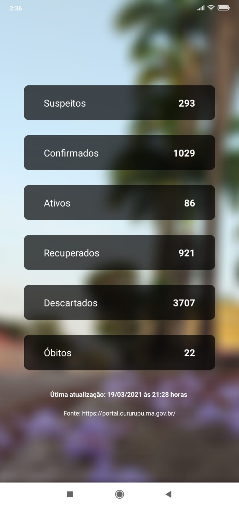

<h1 align="center">Covid CPU</h1>

  

## :memo: Sobre:
Esse aplicativo foi desenvolvido para ajudar a população local a ter acesso instantâneo aos dados da Covid-19 na cidade de Curupu-MA.

<h2 align="center">Screenshots</h2>

## :arrow_down: Download:
Você pode baixar o App por esse link: <a href="#">Download</a> (link off por enquanto)

## :wrench: Tecnologias usadas:
- [ReactNative](https://reactnative.dev/)
- [Expo](https://expo.io/)
- [NextJS](https://nextjs.org/) (para fazer a Api)

## :construction_worker: Como rodar o projeto:
em construção...

## :passport_control: Licensa:
Este projeto está sobre a licensa MIT.
Clique [aqui](https://github.com/th1ag0-Zz/covid-cpu/blob/main/LICENSE) para saber mais

<h3 align="center">
  Feito por <a href="https://www.linkedin.com/in/thiago-furtado-silva/">Thiago Silva</a>
</h3>